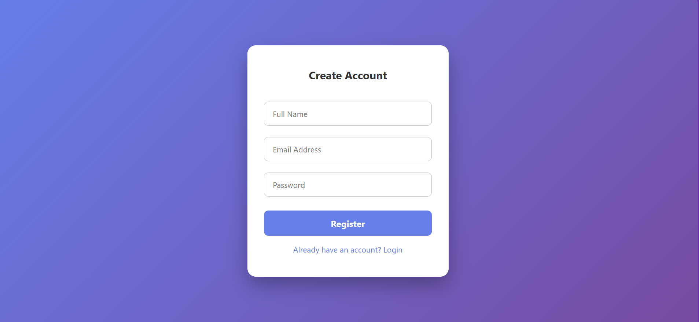
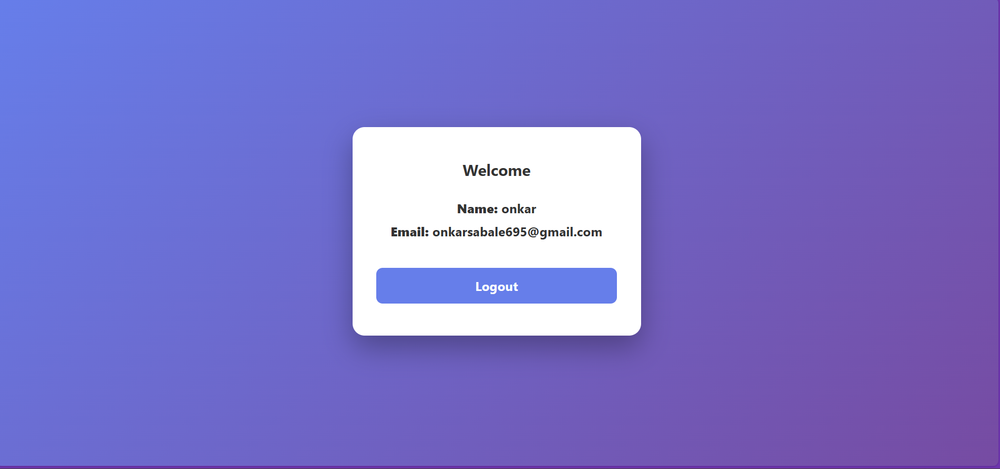

# Angular User Authentication App

> A modern, interactive Angular standalone application for user registration, login, and profile view with reactive forms, animations, and UI enhancements.

This project demonstrates frontend-focused user authentication, form validation, and a smooth user experience. It uses Angular’s Reactive Forms, routing, and component-based architecture, without a backend (users are stored in memory for demo purposes).

---

### App Features

✔ Registration Page with validation & input icons
✔ Login Page with password show/hide toggle
✔ Profile Page displaying user info
✔ Success/Error message animations
✔ Interactive button click animations
✔ Angular Reactive Forms & routing

---

## 🧩 Technologies Used

### Frontend
| Technology | Purpose |
|----------|---------|
| Angular |	Framework for SPA & component architecture
| TypeScript |	Strongly typed JS for Angular components
| HTML | Page structure |
| CSS | Styling and layout |
| FontAwesome | Input icons for better UX |

### Backend
| Technology | Purpose |
|-----------|--------|
| Auth Service (in-memory) | Handles user registration and login logic |

> Note: No persistent backend is used; user data is lost on page reload.

---

## 🚀 How to Run

1. Clone the repository:
   ```bash
   git clone https://github.com/onkarsabale/Simple-User-Auth-App.git

2. Navigate to the project folder:
   ```bash
    cd auth-app
   
3. Install dependencies:
   ```bash
   npm install
   
4. Run the Angular app locally:
   ```bash
   ng serve

Open your browser at: http://localhost:4200/
   
Enjoy!

---

## 📸 Project Demo Screenshots

### Admin Dashboard


### Farmer Management


### Buyer Management



---
